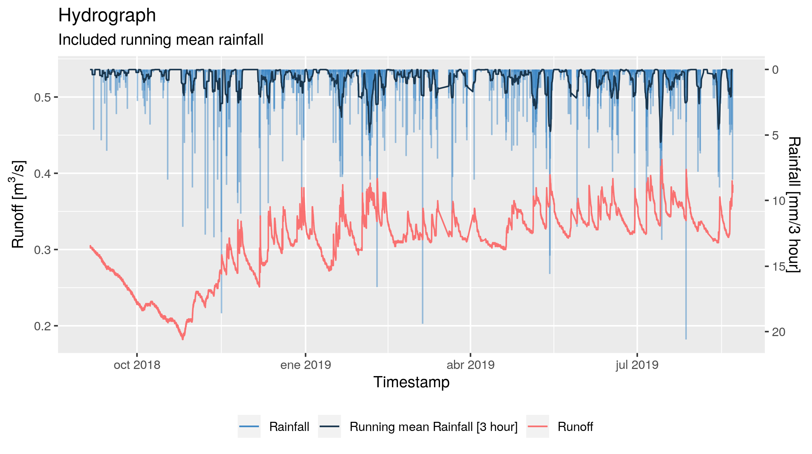

# hydroutils

R package with useful funtions for Hydrological Data Science

## Installation:

`hydrotools` package is not in CRAN, but cand be installed by `devtools` package
functions.

```
# install.packages(devtools)

# from GitLab (main repository)
devtools::install_gitlab('gavg712/hydroutils.git')

# from GitHub (alternative repository)
devtools::install_github('gavg712/hydroutils.git')
```
## Examples

The function `hydrograph` will returna ggplot object. That can be manipulated
following the logic of `ggplot2` package:

``` r
library(hydroutils)
library(ggplot2)

# load data
data("soil_moisture")

soil_moisture %>%
  hydrograph(
    time = timestamp,
    runoff = runoff,
    rain = rain,
    agg.time_unit = "3 hour",
    agg.window = 12
  ) +
  labs(x = "Timestamp", title = "Hydrograph", 
       subtitle = "Included running mean rainfall") +
  theme(legend.position = "bottom")
```



## Troubleshooting

Any issue found? Please let me know. Report bus, issues, etc. at:

* At GitLab (main repository): https://gitlab.com/gavg712/hydroutils/issues
* At GitHub (alternative repository): https://github.com/gavg712/hydroutils/issues
